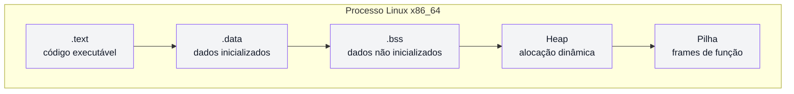
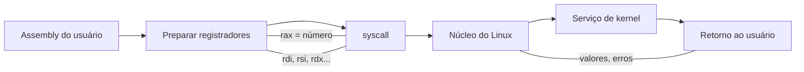

# Visão de arquitetura e fluxo de syscall

Este documento usa Mermaid para explicar visualmente o modelo de processo e o fluxo de chamadas de sistema.

## Layout de memória do processo

## Fluxo de chamada de sistema

## Notas úteis
- A pilha cresce para baixo em x86_64 (`rsp` decrementa).
- `rip` sempre aponta para a próxima instrução.
- Em syscalls Linux, o quarto argumento usa `r10`, o quinto usa `r8` e o sexto usa `r9`.
- Use esses diagramas como referência visual ao estudar `04-arquitetura/`.
